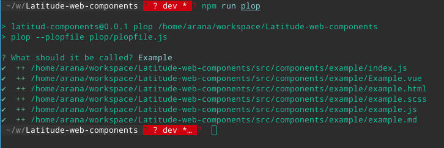
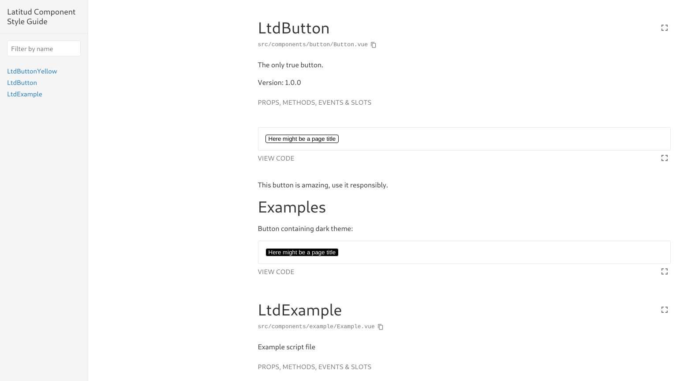

# Latitud Components

Project based in web-components to use in all us project. They are compatible with Angular and Vue projects.

## How use

## Contributing
To contributing you have to read the styleguide and storybook manuel to a good development. Links below.

### Styleguide
Documentation styleguide: [https://vue-styleguidist.github.io/Documenting.html#code-comments](https://vue-styleguidist.github.io/Documenting.html#code-comments)

Documentation JSDoc: [http://usejsdoc.org/](http://usejsdoc.org/)

### Storybook
Documentation: [https://storybook.js.org/docs/basics/introduction/](https://storybook.js.org/docs/basics/introduction/)


Customize configuration: See [Configuration Reference](https://cli.vuejs.org/config/).


## Development

### Project setup
First it is necessary install all dependences.

```
npm install
```

### Compiles and hot-reloads for development with Storybook
The development is based about Storybook library that does a develop server with hot reloads and a global view with all components. Current version 5.


To execute it.

```
npm start
```

## Compiles and minifies for production
To build the library in web components and test them.

```
npm run build
```

The script generate in dist folder a `demo.html` file where you can test all web-components generated.

## Run your tests
Without test currently.

```
npm run test
```

## Lints and fixes files
Script to execute lint checking. The project is configurated to execute the lint in all commit commands.

```
npm run lint
```

## Generate a new component
To generate a new component, we used `plop` like tool.



To execute it.

```
npm run plop
```

When the process finished, generate 5 files in the folder `components/<component_name>`.

```
.
├── example.html
├── example.js
├── example.md
├── example.scss
├── Example.vue
└── index.js
```

* `<component_name>.vue`: File mandatory for link other files. **(No modify)**.
* `index.js`: This file is used to import the component from out.
* `<component_name>.scss`: File to style.
* `<component_name>.hmtl`: File to template.
* `<component_name>.js`: File to write the logic in JS.

To test the new component it's necessary added to `stories/main.js` with `wrap` function to generate a temporal web-component.

```js
const WrappedExample = wrap(Vue, Example)
window.customElements.define('ltd-example', WrappedExample)
```

Later we go to add a new component in storybook or craete a new story if was necessary.

*In the example is created a new story.*

> To call the web-component only add the tag

```js
storiesOf('Example', module)
  .add('Example1', () => ({
    data () {
      return {
        el: undefined
      }
    },
    template: `
    <ltd-example theme='light'>
      <span>Example text</span>
    </ltd-example>
  `,
    mounted () {
      [this.el] = document.getElementsByTagName('ltd-example')
    }
  }))
```

#### Compiles and hot-reloads for development
The styleguide find all components of first level in `components` folder and read all comments in `.js` files and `.md` files. every components.



To execute it.
```
npm run styleguide
```

#### Compiles and minifies for production
To generate the styleguide in static site for production.

To execute it.
```
npm run styleguide:build
```
